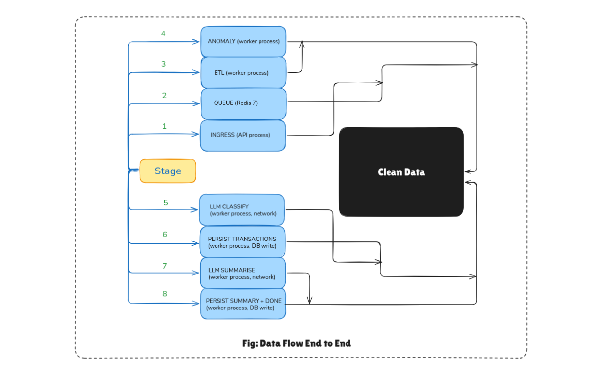
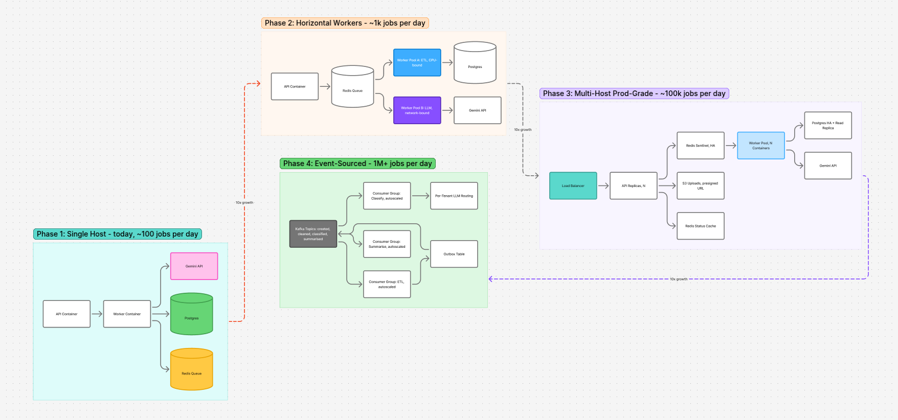

# AI-Powered Transaction Processing Pipeline

A FastAPI + RQ + Postgres service that ingests a messy `transactions.csv`,
runs a defensive ETL → anomaly detection → LLM classification → LLM
narrative on it asynchronously, and exposes the structured output via a
small REST API.


## Table of Contents

1. [Quick Start](#2-quick-start)
2. [Architecture](#3-architecture)
3. [API Contract](#4-api-contract)
4. [System Design & Scaling](#6-system-design--scaling)
   - [4.1 Data Flow](#62-data-flow)
   - [4.2 Scaling Strategy](#65-scaling-strategy)
5. [LLM Integration](#7-llm-integration)
6. [Project Layout](#9-project-layout)
7. [Testing](#10-testing)

**See also:**

- [docs/SPEC_COMPLIANCE.md](docs/SPEC_COMPLIANCE.md) — full PDF §4–§9 traceability matrix
- [docs/ARCHITECTURE.md](docs/ARCHITECTURE.md) — topology, data flow, bottlenecks, scaling phases, capacity
- [docs/OBSERVABILITY.md](docs/OBSERVABILITY.md) — metrics, logs, traces, alerts, health checks
- [docs/ROADMAP.md](docs/ROADMAP.md) — 12 prioritized production improvements

---


## 1. Quick Start

### Option A — Docker (recommended, ~30 seconds)

```bash
cp .env.example .env
# Optional: set GOOGLE_API_KEY=... in .env for real LLM calls
make up
```

Wait ~10 seconds, then:

```bash
curl http://localhost:8000/health                                # {"status":"ok"}
JOB=$(curl -sS -F file=@transactions.csv http://localhost:8000/jobs/upload | jq -r .job_id)
curl -sS http://localhost:8000/jobs/$JOB/status | jq .           # poll until completed/failed
curl -sS http://localhost:8000/jobs/$JOB/results | jq .          # transactions + summary
```

Interactive API docs: <http://localhost:8000/docs>. `make down` stops and
wipes the DB volume.

### Option B — Local Python (no Docker)

```bash
python3 -m venv .venv && source .venv/bin/activate
make install         # pip install -r requirements*.txt
make dev             # uvicorn app.main:app --reload  (SQLite, in-process)
```

Worker runs separately with `make worker` (requires Redis on `localhost:6379`).

### Without `GOOGLE_API_KEY`

Both LLM calls return `{"llm_failed": True}` after retries. The pipeline
**still completes** — ETL, anomaly detection, persistence, and a
deterministic-fallback summary all work.

---

## 2. Architecture


*FastAPI edge tier enqueues jobs into Redis/RQ, workers run ETL → anomaly → LLM classify → LLM summarise → Postgres, with external Gemini calls.*


## 3. API Contract

| Method | Path | Status Codes | Purpose |
|---|---|---|---|
| `GET`  | `/health` | 200 | Liveness probe |
| `POST` | `/jobs/upload` | 202 / 400 / 413 / 415 | Upload CSV, returns `job_id` |
| `GET`  | `/jobs` | 200 | List jobs (newest first; `?status=` filter; `?limit=&offset=`) |
| `GET`  | `/jobs/{id}/status` | 200 / 404 | Job state + summary (if completed) |
| `GET`  | `/jobs/{id}/results` | 200 / 404 / 409 | Full transactions + summary |


## 4. System Design & Scaling

A condensed view of how the system behaves under load. Full detail in
[docs/ARCHITECTURE.md](docs/ARCHITECTURE.md).

### 4.1 Data Flow



A single CSV upload traverses eight stages: ingress → queue → ETL → anomaly →
LLM classify → persist transactions → LLM summarise → persist summary. Each
stage has a clear input/output contract (see [docs/ARCHITECTURE.md §3](docs/ARCHITECTURE.md#3-data-flow--end-to-end)).

**Read path** (client polling `/jobs/{id}/status` or `/results`) is just
`SELECT … FROM jobs / transactions / job_summaries WHERE id = ?` — sub-10ms
on Postgres.


### 4.2 Scaling Strategy



| Phase | Scale | Key change |
|---|---|---|
| **1 — Single host** (today) | ~100 jobs/day | API + worker + Postgres + Redis on one VM |
| **2 — Horizontal workers** | ~1k jobs/day | `docker compose up --scale worker=N`; split CPU-bound ETL workers from network-bound LLM workers |
| **3 — Multi-host prod** | ~100k jobs/day | N API replicas behind LB; Redis Sentinel; managed Postgres with read replicas; S3 for uploads; `COPY` for bulk inserts; Redis cache for status polls |
| **4 — Event-sourced** | 1M+ jobs/day | Kafka topics per stage; streaming ETL; outbox pattern; per-tenant LLM routing; AsyncAPI contracts |

Full phase detail at [docs/ARCHITECTURE.md §5](docs/ARCHITECTURE.md#5-scaling-strategy).


## 5. LLM Integration

- **Provider**: Gemini 2.5 Flash via `google-genai` (free tier, no spend).
  Configure with `GOOGLE_API_KEY`.
- **Batch size**: 20 rows per `classify_categories` call
  (`LLM_BATCH_SIZE=20`, env-overridable).
- **Retry**: 3 attempts, exponential backoff (1s, 2s, 4s) via `tenacity`.
- **Failure isolation**: a failed batch marks all rows `llm_failed=True`; the
  job still completes — only ETL/DB/IO errors mark the job `failed`. The
  summary falls back to a rule-based narrative + risk level
  (`high` if >3 anomalies, `medium` if >0, else `low`).

Provider isolated to `app/services/llm.py` — swapping is one file.

---

## 6. Design Decisions & Tradeoffs

| Decision | Rationale |
|---|---|
| **RQ + Redis (not Celery)** | RQ is pure-Python, simpler, and matches the single-queue topology. Celery's broker / result-backend complexity is overkill here. |
| **Async, job-based (not synchronous)** | LLM calls + ETL can take seconds. Returning a `job_id` and letting the client poll is the right UX. |
| **`JobStore` ABC + SQLAlchemy ORM** | Routes and worker don't care about storage. Tests use SQLite; production uses Postgres. |
| **Store as source of truth (not RQ)** | Job state lives in Postgres. Cancelling / retrying / inspecting a job = `SELECT * FROM jobs WHERE id = ?`. |
| **Pydantic v2** | 5–50× faster than v1, better type inference, native discriminated unions. |
| **No Alembic** | Out of scope for the assignment. `Base.metadata.create_all()` is fine for fresh DBs. Production would add Alembic with a baseline migration. |
| **SQLAlchemy parameter binding everywhere** | No f-string SQL. Injection-safe by construction. |
| **Tenacity for retries** | Production-grade retry lib with explicit attempt counts and backoff. |

---

## 7. Project Layout

```
.
├── app/
│   ├── main.py                # FastAPI app + lifespan
│   ├── config.py              # Pydantic settings (env-driven)
│   ├── database.py            # SQLAlchemy engine + session factory
│   ├── models.py              # ORM: Job, Transaction, JobSummary
│   ├── schemas.py             # Pydantic request/response models
│   ├── dependencies.py        # FastAPI DI
│   ├── adapters/              # Swappable infrastructure (queue, storage)
│   ├── routes/                # HTTP layer (health, jobs)
│   └── services/              # Business logic: etl, anomaly, llm, fx, upload, worker
├── scripts/entrypoint.py      # Container entrypoint: wait for DB/Redis, ensure schema
├── tests/                     # ~30 pytest tests, no external services required
├── docs/                      # ARCHITECTURE, SPEC_COMPLIANCE, OBSERVABILITY, ROADMAP + images/
├── .github/workflows/ci.yml   # Lint + test (coverage threshold) + Docker build
├── Dockerfile                 # Multi-stage, non-root, healthcheck
├── docker-compose.yml         # api + worker + postgres + redis + pgadmin
├── Makefile                   # Common dev commands
├── pyproject.toml             # ruff + pytest config
├── requirements*.txt          # Runtime + dev deps
├── .env.example               # Env template
└── transactions.csv           # Sample data
```

---

## 8. Testing

```bash
make test         # full suite (~30 tests, < 5 s, no services)
make test-cov     # with coverage report
make lint         # ruff check + format check
```

**Test design choices:**

- **No real services in unit tests.** SQLite-in-memory via `StaticPool`,
  `fakeredis` for the queue, `monkeypatch` for env vars. Fast, deterministic,
  no Docker required.
- **Real services in CI.** `.github/workflows/ci.yml` spins up `postgres:16-alpine`
  and `redis:7-alpine` as service containers.
- **LLM is always mocked** in tests — `_classify_call` and `_summarize_call`
  are patched at the module level.

Test modules map 1:1 to spec sections.

---
## License

For interview evaluation only.