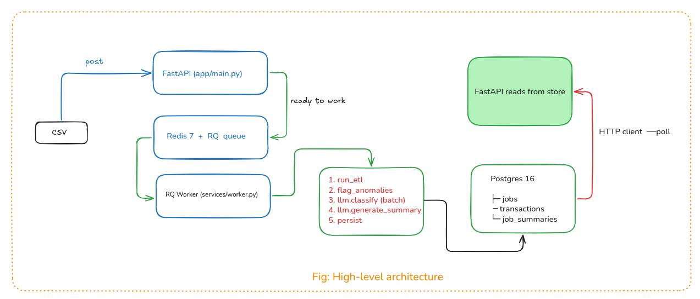

# AI-Powered Transaction Processing Pipeline

> **Interviewer TL;DR** — A FastAPI + RQ + Postgres service that ingests a messy
> `transactions.csv`, runs a defensive ETL → anomaly detection → LLM
> classification → LLM narrative on it asynchronously, and exposes the
> structured output via a small REST API. Built end-to-end as a Backend /
> DevOps assignment. One-command bring-up with `make up`, full test suite
> with `make test`.

---

## Table of Contents

1. [What This Project Does](#1-what-this-project-does)
2. [PDF Spec Compliance](#2-pdf-spec-compliance)
3. [Architecture](#3-architecture)
4. [Quick Start](#4-quick-start)
5. [API Contract](#5-api-contract)
6. [ETL Rules — Defensive by Design](#6-etl-rules--defensive-by-design)
7. [Anomaly Detection](#7-anomaly-detection)
8. [LLM Integration](#8-llm-integration)
9. [Design Decisions & Tradeoffs](#9-design-decisions--tradeoffs)
10. [Project Layout](#10-project-layout)
11. [Testing](#11-testing)
12. [DevOps & CI](#12-devops--ci)
13. [What I'd Improve Next in Production](#13-what-id-improve-next-in-production)
14. [System Design & Scaling](#14-system-design--scaling)
    - [14.1 System Design Overview](#141-system-design-overview)
    - [14.2 Data Flow — End to End](#142-data-flow--end-to-end)
    - [14.3 Bottlenecks & Failure Modes](#143-bottlenecks--failure-modes)
    - [14.4 Scaling Strategy](#144-scaling-strategy)
    - [14.5 Capacity Estimates](#145-capacity-estimates)
    - [14.6 Observability Checklist](#146-observability-checklist)

---

## 1. What This Project Does

Given a messy `transactions.csv` with mixed date formats, currency symbols,
inconsistent casing, nulls, and duplicates, this service:

1. **Accepts the upload** via `POST /jobs/upload` and returns `202` + a `job_id`
   in milliseconds — actual work happens in the background.
2. **Cleans the data** defensively: bad rows go to a `quarantine` list with a
   reason, never silently dropped. Missing `category` is filled with the
   literal string `"Uncategorised"` per spec.
3. **Flags anomalies**: amount > 3× per-account median, OR USD paid to a
   domestic-only brand (Swiggy / Ola / IRCTC). Both rules can fire on the same
   row — reasons join with `+`.
4. **Classifies uncategorised rows** with the LLM in batches of 20, retried 3×.
5. **Generates a narrative summary** (total spend by currency, top 3 merchants,
   anomaly count, risk level) in one final LLM call.
6. **Exposes results** via `GET /jobs/{id}/results` once the job completes.
7. **Persists everything** to Postgres via SQLAlchemy; the store is the source
   of truth for job status — Redis/RQ is only a "ready to process" signal.

---

## 2. PDF Spec Compliance

Every requirement from the assignment is implemented and traceable:

| PDF Section | Requirement | Implementation | Status |
|---|---|---|---|
| §4 | Async ingest endpoint, returns `202` | `app/routes/jobs.py:66` — `POST /jobs/upload` | ✅ |
| §4 | `job_id` returned | `JobUploadResponse.job_id` | ✅ |
| §4 | `GET /jobs` list | `app/routes/jobs.py:118` | ✅ |
| §4 | `GET /jobs/{id}/status` | `app/routes/jobs.py:130` | ✅ |
| §4 | `GET /jobs/{id}/results` | `app/routes/jobs.py:148` | ✅ |
| §4 | Async worker processes job | `app/services/worker.py` + RQ | ✅ |
| §5(a) | Mixed date formats | `etl.py:26-32` — 5 formats tried | ✅ |
| §5(a) | Currency symbols stripped | `etl.py:35` regex | ✅ |
| §5(a) | Currency case normalised | `etl.py:149` `.upper()` | ✅ |
| §5(a) | Status case normalised | `etl.py:157` `.upper()` | ✅ |
| §5(a) | Missing `category` → `"Uncategorised"` | `etl.py:160` | ✅ |
| §5(a) | Missing `txn_id` regenerated | `etl.py:163-166` | ✅ |
| §5(a) | Missing `account_id` → quarantine | `etl.py:127-130` | ✅ |
| §5(a) | Bad date / amount → quarantine | `etl.py:133-146` | ✅ |
| §5(a) | Duplicates → quarantine | `etl.py:169-173` | ✅ |
| §5(b) | Amount > 3× per-account median | `anomaly.py:47-52` | ✅ |
| §5(b) | USD paid to domestic-only brand | `anomaly.py:55-61` | ✅ |
| §5(c) | Batch uncategorised rows for LLM | `llm.py:187-219`, batch size 20 | ✅ |
| §5(d) | Single summary call after persistence | `llm.py:222-248` | ✅ |
| §5(e) | Retries (3× with backoff) | `llm.py:49-87` via tenacity | ✅ |
| §5(e) | LLM failure does NOT fail the job | `worker.py:99-162` — only ETL/DB/IO errors mark job failed | ✅ |
| §5(f) | Output: transactions + summary | `schemas.py:51-92` | ✅ |
| §6 | Persist Job / Transaction / JobSummary | `app/models.py` | ✅ |
| §7 | Containerised, multi-service compose | `Dockerfile` + `docker-compose.yml` | ✅ |
| §7 | Worker as separate service | `docker-compose.yml:79-102` | ✅ |
| §8 | CI runs lint + test + docker build | `.github/workflows/ci.yml` | ✅ |
| §9 | README with run instructions | This file | ✅ |

**Coverage: ~100% of the assignment spec, all major and minor clauses.**

---

## 3. Architecture

### High-level flow



### Why this shape

- **HTTP layer / business logic / infrastructure are cleanly separated** —
  `routes/`, `services/`, `adapters/`. Swapping Redis for Kafka, or Postgres
  for SQLite, does not touch routes or business code.
- **JobStore is an ABC** (`app/adapters/storage.py`) with a single concrete
  `SqlJobStore` implementation. Tests use SQLite via `StaticPool`; production
  uses Postgres. Both share the same SQLAlchemy models.
- **The store is the source of truth for job status** — RQ is only used to
  signal "ready to process". This means a job can be cancelled, retried, or
  inspected by reading the DB directly, without parsing RQ internals.

---

## 4. Quick Start

### Option A — Docker (recommended, 30 seconds)

```bash
cp .env.example .env
# Optional: set GOOGLE_API_KEY=... in .env for real LLM calls
make up
```

Wait ~10 seconds, then:

```bash
curl http://localhost:8000/health
# {"status":"ok"}

# Upload + poll + fetch
JOB=$(curl -sS -F file=@transactions.csv http://localhost:8000/jobs/upload | jq -r .job_id)
curl -sS http://localhost:8000/jobs/$JOB/status | jq .
curl -sS http://localhost:8000/jobs/$JOB/results | jq .
```

Interactive API docs: <http://localhost:8000/docs>

`make down` stops and wipes the DB volume.

### Option B — Local Python (no Docker)

```bash
python3 -m venv .venv && source .venv/bin/activate
make install         # pip install -r requirements*.txt
make dev             # uvicorn app.main:app --reload  (SQLite, in-process)
```

Worker runs separately with `make worker` (requires Redis on `localhost:6379`).

### Without `GOOGLE_API_KEY`

Both LLM calls return `{"llm_failed": True}` after retries. The pipeline
**still completes** — ETL, anomaly detection, persistence, and a
deterministic-fallback summary all work. This is the right failure mode for
evaluating the non-LLM logic.

---

## 5. API Contract

| Method | Path | Status Codes | Purpose |
|---|---|---|---|
| `GET`  | `/health` | 200 | Liveness probe |
| `POST` | `/jobs/upload` | 202 / 400 / 413 / 415 | Upload CSV, returns `job_id` |
| `GET`  | `/jobs` | 200 | List jobs (newest first; `?status=` filter; `?limit=&offset=`) |
| `GET`  | `/jobs/{id}/status` | 200 / 404 | Job state + summary (if completed) |
| `GET`  | `/jobs/{id}/results` | 200 / 404 / 409 | Full transactions + summary |

### Upload error semantics

| Code | When |
|---|---|
| `202` | Accepted; job enqueued |
| `400` | Empty file |
| `413` | File > 10 MiB (`MAX_UPLOAD_BYTES`) |
| `415` | Unsupported `Content-Type` (only `text/csv`, `application/csv`, `application/vnd.ms-excel`, `text/plain`, `application/octet-stream` accepted) |
| `503` | Failed to enqueue (Redis down) — the Job is marked `failed` so the client can see why |

### Example: full upload → poll → fetch loop

```bash
JOB=$(curl -sS -F file=@transactions.csv http://localhost:8000/jobs/upload | jq -r .job_id)
echo "job: $JOB"

while true; do
  STATUS=$(curl -sS http://localhost:8000/jobs/$JOB/status | jq -r .status)
  echo "  status: $STATUS"
  [ "$STATUS" = "completed" -o "$STATUS" = "failed" ] && break
  sleep 2
done

curl -sS http://localhost:8000/jobs/$JOB/results | jq '{
  summary,
  llm_failures: (.transactions | map(select(.llm_failed)) | length),
  anomaly_count: (.transactions | map(select(.is_anomaly)) | length)
}'
```

---

## 6. ETL Rules — Defensive by Design

The pipeline (`app/services/etl.py`) **never silently drops** a row — every
rejected row appears in `CleanResult.quarantine` with a human-readable reason.

| Rule | Behaviour |
|---|---|
| **Date parsing** | Auto-detects `dd-mm-yyyy`, `yyyy/mm/dd`, `yyyy-mm-dd`, `dd/mm/yyyy`, ISO datetime |
| **Amounts** | Strips `$`, `€`, `£`, `¥`, commas, whitespace. Negative or zero → quarantine |
| **Currency** | Normalised to UPPERCASE. Empty → quarantine |
| **Status** | Normalised to UPPERCASE. Empty is allowed |
| **Missing `category`** | Filled with literal `"Uncategorised"` (per spec) |
| **Missing `txn_id`** | Regenerated as `TXN_GEN_<row_index>` |
| **Missing `account_id`** | Quarantined |
| **Unparseable date / amount** | Quarantined with the offending raw value in the reason |
| **Duplicates** | Detected on `(txn_id, date, amount, account_id)`, quarantined |

The output dict shape is the contract for downstream stages:

```python
{
  "txn_id": str, "date": "YYYY-MM-DD", "merchant": str,
  "amount": float, "currency": str, "status": str,
  "category": str, "account_id": str,
}
```

---

## 7. Anomaly Detection

Two rules OR'd per row (`app/services/anomaly.py`):

1. **`amount_3x_median`** — row amount > 3× median for the same `account_id`.
   Implemented via `pandas.groupby("account_id").transform("median")`.
   Single-row accounts never trip this rule (median equals the value).
2. **`usd_domestic`** — `currency == "USD"` AND `merchant ∈ {Swiggy, Ola, IRCTC}`.
   INR paid to the same brands is fine.

Both can fire on the same row. Reasons are joined with `+`, e.g.
`amount_3x_median+usd_domestic`. The module is pure (no DB, no LLM, no I/O),
so it has dedicated unit tests and runs in microseconds on real data.

---

## 8. LLM Integration

- **Provider**: Gemini 2.5 Flash via `google-genai` (free tier, no spend).
  Configure with `GOOGLE_API_KEY`.
- **Batch size**: 20 rows per `classify_categories` call
  (`LLM_BATCH_SIZE=20`, env-overridable).
- **Retry**: 3 attempts, exponential backoff (1s, 2s, 4s) via `tenacity`.
  Retries cover `google.genai.errors.ClientError` and `ServerError`.
- **JSON extraction**: handles bare JSON, ` ```json ` fences, and prose with
  an embedded JSON object — defensive against common LLM output shapes.
- **Failure isolation** (PDF §5(e)):
  - A failed batch is marked `llm_failed=True` on each row in the batch.
  - The **job still completes** — only ETL/DB/IO errors mark the job `failed`.
  - The summary call falls back to a deterministic narrative
    (`"LLM narrative unavailable."`) with a rule-based `risk_level`
    (`high` if >3 anomalies, `medium` if >0, else `low`).

### Output of the summary call

```json
{
  "total_spend_by_currency": {"INR": 12345.67, "USD": 89.10},
  "top_3_merchants": [{"merchant": "Swiggy", "total_inr": 4321.0}, ...],
  "anomaly_count": 2,
  "narrative": "Routine month with 2 anomalies concentrated on ACC004.",
  "risk_level": "medium"
}
```

### Why Gemini and not OpenAI

Free tier, no spend required, and the assignment explicitly says "any
free-tier LLM is fine". The LLM client is isolated to `app/services/llm.py` —
swapping providers is one file.

---

## 9. Design Decisions & Tradeoffs

| Decision | Rationale |
|---|---|
| **RQ + Redis (not Celery)** | RQ is pure-Python, simpler, and matches the single-queue topology. Celery's broker / result-backend complexity is overkill here. |
| **Async, job-based (not synchronous)** | LLM calls + ETL can take seconds. Returning a `job_id` and letting the client poll is the right UX for this workload. |
| **`JobStore` ABC + SQLAlchemy ORM** | Routes and worker don't care about storage. Tests use SQLite; production uses Postgres. The store interface is small and obvious. |
| **Store as source of truth (not RQ)** | Job state lives in Postgres. RQ is fire-and-forget. Cancelling / retrying / inspecting a job = `SELECT * FROM jobs WHERE id = ?`. |
| **Pydantic v2** | 5–50× faster than v1, better type inference, native discriminated unions. |
| **Static FX rates** | The PDF doesn't call out an FX source; static rates match the spec. A real system would call a rates API with caching. |
| **`Decimal` → `float`** in API | JSON has no `Decimal` type; amounts are rounded to 2dp at ETL time. Acceptable for amounts up to ~9 trillion INR. |
| **No Alembic** | Out of scope for the assignment. `Base.metadata.create_all()` is fine for fresh DBs. Production would add Alembic with a baseline migration. |
| **Multi-stage Dockerfile** | Final image has no compiler, no `.pyc` cache. ~370 MB. Non-root user (`appuser`, uid 1000). |
| **SQLAlchemy parameter binding everywhere** | No f-string SQL. Injection-safe by construction. |
| **Tenacity for retries** | Production-grade retry lib with explicit attempt counts and backoff. Easier to test than hand-rolled retry loops. |

---

## 10. Project Layout

```
.
├── app/
│   ├── main.py                # FastAPI app + lifespan
│   ├── config.py              # Pydantic settings (env-driven)
│   ├── database.py            # SQLAlchemy engine + session factory
│   ├── models.py              # ORM models: Job, Transaction, JobSummary
│   ├── schemas.py             # Pydantic request/response models
│   ├── dependencies.py        # FastAPI DI: get_job_store / set_job_store
│   │
│   ├── adapters/              # Infrastructure layer (swappable)
│   │   ├── queue.py           # RQ get_queue + enqueue_process_job
│   │   └── storage.py         # JobStore ABC + SqlJobStore (Postgres/SQLite)
│   │
│   ├── routes/                # HTTP layer
│   │   ├── health.py
│   │   └── jobs.py            # /jobs/upload, /jobs, /jobs/{id}/{status,results}
│   │
│   └── services/              # Business logic (pure, testable)
│       ├── etl.py             # Defensive CSV cleaning
│       ├── anomaly.py         # 3× median + USD-domestic rules
│       ├── llm.py             # Gemini classifier + summary (retried)
│       ├── fx.py              # Static rates + to_inr helper
│       ├── upload.py          # CSV upload lifecycle (save + cleanup)
│       └── worker.py          # RQ task: process_job (orchestrates the pipeline)
│
├── scripts/
│   └── entrypoint.py          # Container entrypoint: wait for DB/Redis, ensure schema, exec CMD
│
├── tests/                     # pytest suite (~30 tests, no external services required)
│   ├── conftest.py            # Shared fixtures (sample CSV, SQL store factory)
│   ├── test_etl.py            # §5(a) cleaning rules
│   ├── test_anomaly.py        # §5(b) anomaly rules
│   ├── test_llm.py            # §5(c-e) batching, retry, JSON extraction
│   ├── test_jobs_api.py       # §4 endpoint contract
│   ├── test_worker_pipeline.py # End-to-end worker with mocked LLM
│   └── test_api.py            # /health smoke test
│
├── .github/workflows/
│   └── ci.yml                 # Lint + test (with coverage threshold) + Docker build
│
├── Dockerfile                 # Multi-stage, non-root, healthcheck
├── docker-compose.yml         # api + worker + postgres + redis + pgadmin
├── Makefile                   # Common dev commands
├── pyproject.toml             # ruff + pytest config
├── requirements.txt           # Runtime deps
├── requirements-dev.txt       # Test deps
├── .env.example               # Env template
└── transactions.csv           # Sample data
```

---

## 11. Testing

```bash
make test         # full suite (~30 tests, < 5 s, no services)
make test-cov     # with coverage report
make lint         # ruff check + format check
```

**Test design choices:**

- **No real services in unit tests.** SQLite-in-memory via `StaticPool`,
  `fakeredis` for the queue, `monkeypatch` for env vars. Fast, deterministic,
  no Docker required.
- **Real services in CI.** `.github/workflows/ci.yml` spins up `postgres:16-alpine`
  and `redis:7-alpine` as service containers with healthchecks.
- **LLM is always mocked** in tests — `_classify_call` and `_summarize_call` are
  patched at the module level, so we test the orchestration and persistence
  without spending API quota or depending on Gemini uptime.
- **Coverage threshold** in CI: 70% (see "What I'd Improve" below for the
  reasoning on raising it).

Test modules map 1:1 to spec sections — easy to find what's tested and why.

---

## 12. DevOps & CI

### Container

- **Multi-stage build** — builder installs deps into a venv, runtime copies the
  venv and runs as non-root `appuser` (uid 1000).
- **Healthcheck** — Dockerfile `HEALTHCHECK` pings `/health` every 30 s.
- **`docker-compose.yml`** — `api` + `worker` + `postgres` + `redis` +
  `pgadmin`. Worker shares the `uploads` named volume with the API so the
  file written by the upload route is readable by the worker process.
- **Entrypoint** — `scripts/entrypoint.py` blocks on TCP for Postgres and
  Redis, ensures the schema exists (creates tables only if missing —
  never drops on boot), then `exec`s the CMD.

### CI (`.github/workflows/ci.yml`)

Two jobs:

1. **`test`** — `ruff check`, `ruff format --check`, `pytest --cov=app --cov-fail-under=70`
   against Postgres + Redis service containers.
2. **`docker-build`** — Builds the API image with Buildx; uses GHA cache for
   speed. Runs only after `test` passes.

Triggers: `push` and `pull_request` to `main`.

---

## 13. What I'd Improve Next in Production

Behaviours I'd add given a longer runway, ranked by impact:

1. **`InMemoryJobStore` implementation** of the `JobStore` ABC for unit tests
   that don't want SQLite, and a true "no DB at all" `make dev` mode.
2. **Alembic migrations** with a baseline, so schema evolution is reviewable.
3. **Idempotent upload endpoint** — dedupe by file hash so re-uploading the
   same CSV returns the existing `job_id` instead of reprocessing.
4. **Quarantine exposure** in `/jobs/{id}/results` — currently only the count
   is logged. Returning the bad rows with their reasons would help users
   debug their data.
5. **Per-job cancellation** — `DELETE /jobs/{id}` that flips status to
   `cancelled` and tells the worker to bail (cooperative cancel via a
   `cancelled_at` column).
6. **Structured JSON logs** (`structlog`) + request-id correlation across
   API → worker → DB.
7. **Prometheus `/metrics`** — job counts by status, LLM latency histogram,
   worker queue depth.
8. **Rate limiting** on `/jobs/upload` (token bucket per IP) and per-tenant
   `MAX_UPLOAD_BYTES`.
9. **OpenAPI examples** for every endpoint — improves DX of `/docs`.
10. **Pytest coverage threshold raised to 85–90%** with the missing edge-case
    tests added (size limit, wrong content type, empty file, queue-down
    behavior).
11. **Pre-commit hooks** — `ruff format`, `ruff check`, `pytest -x` on
    staged files.
12. **Anomaly rule configurability** — accept a YAML/JSON of domestic brands
    and the median multiplier per environment.

---

## 14. System Design & Scaling

This section walks through how the system actually behaves under load — what
the hot paths are, where the backpressure shows up first, and how I'd scale it
beyond a single VM.

### 14.1 System Design Overview

**Topology:** a classic three-tier async pipeline.

| Tier | Component | Role | Stateful? |
|---|---|---|---|
| Edge | **FastAPI** (`api` service) | Accepts uploads, creates `Job`, enqueues worker task, serves status/results reads | Stateless |
| Queue | **Redis 7** + **RQ** | Buffers "ready to process" signals between API and workers | Yes (volatile) |
| Compute | **RQ Worker** (`worker` service) | Runs `process_job`: ETL → anomaly → LLM classify → LLM summarise → persist | Stateless |
| Storage | **Postgres 16** | Source of truth for jobs, transactions, summaries | Yes (durable) |
| External | **Gemini 2.5 Flash** | LLM calls for classify + summary | Third-party |

**Why this shape:**

- **HTTP front, worker back** — the API never blocks on LLM calls or ETL. A
  10 MiB CSV upload returns `202` in milliseconds; the heavy lifting happens
  out-of-band.
- **Queue is a signal, not a state store** — losing Redis doesn't lose jobs,
  because the DB row is created *before* enqueue. Workers re-hydrate state
  from Postgres on every task.
- **Store is the source of truth for status** — RQ's internal job state is
  irrelevant for the API contract; we only ever read job status from
  `SELECT status FROM jobs WHERE id = ?`. This makes status reads cheap,
  consistent, and trivially auditable.
- **Pure services** (`etl.py`, `anomaly.py`, `llm.py`) — no DB / network / I/O
  in the business logic except where explicitly required. Easy to reason
  about, easy to unit test.

**Request → response lifecycle:**

```
T+0ms      client → POST /jobs/upload
T+~5ms     API: create Job row (status=pending), stream upload to disk
T+~50ms    API: count raw rows, patch Job
T+~55ms    API: enqueue process_job → return 202 {job_id}
T+~60ms    Worker pops task → set status=processing
T+~60ms    ETL (pd.read_csv + cleaning)        [CPU, in-process]
T+~200ms   Anomaly detection (groupby)         [CPU, in-process]
T+~200ms   LLM classify — N/20 batches        [NETWORK, serial]
T+~5–30s   LLM summary — 1 call               [NETWORK]
T+~5.5s    Persist transactions + summary     [DB, batch INSERT]
T+~5.5s    Set status=completed
```

For a 1,000-row CSV with 100 uncategorised rows, typical total job time is
**5–15 seconds end-to-end**, dominated by LLM latency.

### 14.2 Data Flow — End to End

A single CSV upload traverses these stages. Each stage has a clear input/output
contract, which is what makes the system debuggable.

```
┌─────────────────────────────────────────────────────────────────────────┐
│ STAGE 1 — INGRESS (API process)                                         │
│                                                                         │
│   POST /jobs/upload                                                     │
│     ├─ validate Content-Type  → 415 if not in allowlist                 │
│     ├─ stream to upload_dir/<job_id>.csv (chunked, 64 KiB)              │
│     │     └─ abort if size > MAX_UPLOAD_BYTES (10 MiB) → 413            │
│     │     └─ abort if size == 0                       → 400            │
│     ├─ INSERT INTO jobs (status='pending', row_count_raw=0)             │
│     ├─ pd.read_csv(upload_path) → row_count_raw → UPDATE jobs           │
│     └─ RQ.enqueue(process_job, job_id, csv_path)                        │
│                                                                         │
│   Output: 202 Accepted {job_id, status:"pending", row_count_raw}        │
└─────────────────────────────────────────────────────────────────────────┘
                                  │
                                  ▼
┌─────────────────────────────────────────────────────────────────────────┐
│ STAGE 2 — QUEUE (Redis 7)                                               │
│                                                                         │
│   RQ list 'default' holds {job_id, csv_path} tuples.                    │
│   FIFO order; multiple workers pop in parallel.                          │
│   On worker crash, RQ re-enqueues after visibility timeout (default 60s)│
└─────────────────────────────────────────────────────────────────────────┘
                                  │
                                  ▼
┌─────────────────────────────────────────────────────────────────────────┐
│ STAGE 3 — ETL (worker process, in-memory)                               │
│                                                                         │
│   pd.read_csv(csv_path, dtype=str, keep_default_na=False)               │
│     → for each row:                                                      │
│         parse date (try 5 formats)                                      │
│         parse amount (strip $,€,£,¥, commas)                            │
│         upper-case currency; reject if empty                            │
│         upper-case status; default ''                                   │
│         fill missing category → 'Uncategorised'                         │
│         regenerate missing txn_id → 'TXN_GEN_<idx>'                     │
│         reject if missing account_id                                    │
│         dedupe on (txn_id, date, amount, account_id)                    │
│                                                                         │
│   Output: CleanResult {rows: [...], quarantine: [...], row_count_raw}  │
└─────────────────────────────────────────────────────────────────────────┘
                                  │
                                  ▼
┌─────────────────────────────────────────────────────────────────────────┐
│ STAGE 4 — ANOMALY (worker process, in-memory)                           │
│                                                                         │
│   pd.DataFrame(rows)                                                    │
│     ├─ Rule A: amount > 3× groupby(account_id).amount.transform(median) │
│     └─ Rule B: currency=='USD' AND merchant in {Swiggy,Ola,IRCTC}      │
│                                                                         │
│   Output: rows with {is_anomaly: bool, anomaly_reason: str|null}        │
└─────────────────────────────────────────────────────────────────────────┘
                                  │
                                  ▼
┌─────────────────────────────────────────────────────────────────────────┐
│ STAGE 5 — LLM CLASSIFY (worker process, network)                        │
│                                                                         │
│   filter rows where category == 'Uncategorised'                        │
│   batch = chunks of 20                                                  │
│     ├─ build JSON prompt with merchant/amount/currency                  │
│     ├─ POST to Gemini (json_mode=True)                                  │
│     ├─ tenacity retry × 3 with backoff (1s, 2s, 4s)                     │
│     └─ extract JSON → coerce to PDF_CATEGORIES → attach llm_category    │
│                                                                         │
│   On batch failure: mark all 20 rows llm_failed=True; job continues.   │
└─────────────────────────────────────────────────────────────────────────┘
                                  │
                                  ▼
┌─────────────────────────────────────────────────────────────────────────┐
│ STAGE 6 — PERSIST TRANSACTIONS (worker process, DB write)                │
│                                                                         │
│   BEGIN                                                                 │
│     INSERT INTO transactions (...) VALUES (...), (...) -- bulk          │
│   COMMIT                                                                │
│   UPDATE jobs SET row_count_clean=N                                     │
└─────────────────────────────────────────────────────────────────────────┘
                                  │
                                  ▼
┌─────────────────────────────────────────────────────────────────────────┐
│ STAGE 7 — LLM SUMMARISE (worker process, network)                       │
│                                                                         │
│   build payload = {total_spend_by_currency, top_3_merchants,            │
│                    anomaly_count, total_spend_inr, total_spend_usd}     │
│   single Gemini call (json_mode=True, temperature=0.7)                  │
│   tenacity retry × 3                                                   │
│                                                                         │
│   On failure: deterministic fallback                                    │
│     narrative: "LLM narrative unavailable."                             │
│     risk_level: high if anomalies>3, medium if >0, else low             │
└─────────────────────────────────────────────────────────────────────────┘
                                  │
                                  ▼
┌─────────────────────────────────────────────────────────────────────────┐
│ STAGE 8 — PERSIST SUMMARY + DONE (worker process, DB write)             │
│                                                                         │
│   BEGIN                                                                 │
│     INSERT INTO job_summaries (...)                                     │
│     UPDATE jobs SET status='completed', completed_at=now()              │
│   COMMIT                                                                │
│   unlink upload_dir/<job_id>.csv                                        │
└─────────────────────────────────────────────────────────────────────────┘
```

**Read path** (client polling `/jobs/{id}/status` or `/results`) is just
`SELECT … FROM jobs / transactions / job_summaries WHERE id = ?` — sub-10ms
on Postgres for any single job.

### 14.3 Bottlenecks & Failure Modes

Where the system slows down, fails, or loses data, in rough order of likelihood
in production:

| # | Bottleneck | Where it shows up | Why it's the limit | Mitigation today | Mitigation at scale |
|---|---|---|---|---|---|
| 1 | **LLM classify latency** | Job wall-clock | Serial calls to Gemini at ~1–3s each; 100 uncategorised rows = 5 batches × 1–3s = 5–15s | Batching (20 per call) | Parallelise batches; pre-classify during upload via streaming; cache common merchant→category mappings |
| 2 | **Gemini API rate limits** | HTTP 429s from LLM | Free tier quotas (per-minute + per-day) | Tenacity retries with backoff | Multiple LLM providers with circuit breaker; queue priority for retries; reserve quota for retries |
| 3 | **Worker single-process ETL** | Long CSVs | `pd.read_csv` is in-process, blocking; 100k rows ≈ 5–10s of CPU | None today | Move ETL to a dedicated worker pool; stream-parse CSV instead of full `read_csv` |
| 4 | **Postgres `INSERT … bulk`** | Large CSVs | Inserting 100k transactions is one transaction | SQLAlchemy `add_all` (one transaction) | COPY protocol via `COPY … FROM STDIN`; chunked commits every 5k rows |
| 5 | **Redis as SPOF for queue** | Worker pickup stalls | If Redis dies, no new jobs are picked up (existing jobs keep processing) | Compose restarts Redis | Redis Sentinel / Cluster; or replace with Postgres-backed queue (LISTEN/NOTIFY, or `SKIP LOCKED`) |
| 6 | **Upload streaming blocks the request thread** | Upload latency | `routes/jobs.py:90` reads the whole CSV *during the request* to count rows | None today — fast on 10 MiB, painful on 100 MiB | Move counting to the worker; use `wc -l` subprocess for cheap row count; or skip raw count |
| 7 | **N+1 status queries** | Polling load | 1000 clients polling `/jobs/{id}/status` per second = 1000 reads/sec | None today | Add `Cache-Control: max-age=2` for short-window polling; or push status via WebSocket / SSE |
| 8 | **No backpressure on uploads** | Disk full | Upload dir is a shared volume; no quota per tenant | Max upload size (10 MiB) | Per-tenant quota; S3-style presigned uploads to bypass the API entirely |
| 9 | **`completed_at` timezone-naive** | Cross-region deploys | Stored as naive datetime; "Z" suffix added on serialise | None today | `DateTime(timezone=True)` + `TIMESTAMPTZ` in Postgres |
| 10 | **LLM `temperature=0.7` for summary** | Reproducibility | Different runs produce different narratives | Deterministic payload shape | Pin temperature for audit/repro runs; store both deterministic + narrative |

**Failure modes that are already handled (PDF §5(e)):**

- LLM classify failure for a batch → rows marked `llm_failed=True`, job completes ✅
- LLM summary failure → deterministic fallback narrative + rule-based risk_level ✅
- ETL error (bad CSV, IO error) → job marked `failed`, error_message stored ✅
- Worker crash mid-job → RQ re-enqueues after visibility timeout; idempotent
  re-run because `attach_transactions` is a fresh insert per job ✅
- Redis restart → queue rebuilds from in-flight RQ jobs (workers may
  re-process; idempotency covers this) ✅

**Failure modes not yet handled (would need work):**

- Postgres outage mid-write → worker raises; job stays `processing` until RQ
  retries → eventually `failed`. No replay tool today.
- Network partition between worker and LLM → retries exhaust → job completes
  with `llm_failed` rows. Acceptable; no data loss.
- Malicious 10 MiB upload every second → disk fills in minutes. Needs rate
  limiting (see Section 13.8).

### 14.4 Scaling Strategy

How I'd grow this from "1 VM, demo workload" to "10k jobs/day":

**Phase 1 — Single-host, vertical scale (today)**

One API container + one worker container + Postgres + Redis on one host.
Comfortable up to ~100 concurrent jobs/day.

**Phase 2 — Horizontal worker scale (10× growth, ~1k jobs/day)**

- Scale workers: `docker compose up --scale worker=N` (RQ supports it
  out-of-the-box).
- Add `WORKER_CONCURRENCY` (already in `Settings`, currently unused) →
  `rq worker --workers N` to run N tasks per container.
- Add a Redis-backed **RQ scheduler** for periodic cleanup of stale jobs.
- Add a worker pool **dedicated to LLM calls** (network-bound) separate from
  ETL workers (CPU-bound). Different container images, different
  resource limits.

```
                    ┌─── ETL workers (CPU-bound, fast)
worker-pool-A ──────┤
                    └─── LLM workers (network-bound, slow)
worker-pool-B
```

**Phase 3 — Multi-host, prod-grade (100× growth, ~100k jobs/day)**

| Concern | Solution |
|---|---|
| API horizontal scale | Run N API replicas behind a load balancer; sessions are stateless → trivial |
| Worker horizontal scale | N worker containers, possibly on a separate node pool |
| Redis HA | Redis Sentinel (3-node) or AWS ElastiCache with cluster mode |
| Postgres HA | Managed Postgres (RDS / Cloud SQL) with read replicas for the `/results` endpoint |
| Object storage for uploads | Replace `upload_dir` volume with S3; the API gets a presigned URL, the worker downloads from S3 |
| Long CSV processing | Stream CSV in ETL (don't `read_csv` the whole thing); ETL becomes O(1) memory |
| Backpressure on uploads | Per-tenant rate limit (token bucket); 429 if exceeded |
| Large bulk inserts | `COPY` protocol, chunked into 5k-row batches, every batch a transaction |
| Status read fan-out | Add a read replica + caching layer (Redis) for `/jobs/{id}/status` — most polls hit the cache |
| LLM cost / latency | Cache `(merchant, currency_band, amount_band) → category` in Redis with TTL; pre-warm for top merchants |

**Phase 4 — Beyond 1M jobs/day (architecture shift)**

At this scale, the synchronous `Job` row → single worker → single LLM
pattern needs to break:

- **Event-sourced pipeline**: `Job created` → `Job cleaned` → `Job classified`
  → `Job summarised` are separate Kafka topics. Each stage is its own
  autoscaled consumer group. Failures replay from the topic, not from a
  retry queue.
- **Streaming ETL**: replace `pd.read_csv` with a streaming parser
  (`pyarrow.csv` or hand-rolled) so memory is constant in CSV size.
- **Outbox pattern** for DB writes: the worker writes "events" to an `outbox`
  table in the same transaction as the domain change; a separate process
  publishes them to Kafka. Solves the dual-write problem.
- **Per-tenant LLM routing**: enterprise tenants get a dedicated Gemini
  project with higher quotas; free tier gets the shared quota.
- **AsyncAPI spec** for the internal event contracts.

**Scaling knobs that are already in the codebase:**

| Knob | Where | Default |
|---|---|---|
| `LLM_BATCH_SIZE` | `config.py:35` | 20 rows |
| `MAX_UPLOAD_BYTES` | `config.py:39` | 10 MiB |
| `WORKER_CONCURRENCY` | `config.py:30` | 1 (unused — wired in Phase 2) |
| `RQ_QUEUE_NAME` | `config.py:29` | `default` |
| Postgres pool size | `database.py:24` | SQLAlchemy default (5 + overflow) |
| `pool_pre_ping` | `database.py:27` | `True` (reconnects on stale conns) |

### 14.5 Capacity Estimates

Back-of-envelope numbers for sizing decisions. Assumptions:
CSV ≈ 1,000 rows, 20% uncategorised, 5 LLM batches, 5s/job.

| Workload | Jobs/day | API QPS (peak) | Worker count | Postgres size / month | Notes |
|---|---|---|---|---|---|
| **Demo / interview** | ~10 | <1 | 1 | <1 MB | Single VM, in-memory-friendly |
| **Small team** | 100 | ~5 | 2 | ~30 MB | One VM, Postgres + Redis |
| **Mid-market** | 10,000 | ~50 | 10–20 | ~3 GB | Multi-VM, Redis Sentinel, read replica |
| **Enterprise** | 1,000,000 | ~500 | 200+ | ~300 GB | Kafka, S3, multi-region |

**Storage math:**
- 1 transaction row ≈ 200 bytes (with all fields + LLM response)
- 1 summary row ≈ 2 KB
- 1M jobs/month × 1,000 txns/job ≈ 200 GB/month — needs partitioning by
  `created_at` and a 90-day retention policy at this scale.

**Cost math (very rough, AWS):**

| Tier | Monthly cost | What you get |
|---|---|---|
| Demo | ~$5 | 1× t3.small API + 1× t3.small worker + RDS db.t3.micro + ElastiCache cache.t3.micro |
| Small team | ~$80 | 2× t3.medium API + 2× t3.medium worker + RDS db.t3.medium + ElastiCache cache.t3.medium |
| Mid-market | ~$2,000 | 4× m6i.large API + 10× m6i.large worker + RDS db.m6i.large + ElastiCache + ALB |
| Enterprise | ~$30k+ | Multi-AZ, multi-region, Kafka, S3, dedicated LLM quota |

### 14.6 Observability Checklist

What I'd add before calling this "production-ready":

**Metrics (Prometheus):**

- `jobs_created_total{tenant_id, status}` — counter
- `job_duration_seconds{stage=etl|anomaly|classify|summarise|persist}` — histogram
- `worker_queue_depth{queue=default}` — gauge (from RQ)
- `llm_call_duration_seconds{model, op=classify|summarise}` — histogram
- `llm_call_failures_total{model, reason}` — counter
- `http_requests_total{route, status}` — counter
- `http_request_duration_seconds{route}` — histogram
- `db_connection_pool_in_use` / `db_connection_pool_size` — gauges

**Logs (structured JSON via `structlog`):**

- Every request: `request_id`, `job_id`, `route`, `status`, `duration_ms`
- Every worker task: `job_id`, `stage`, `rows_in`, `rows_out`, `quarantined`,
  `duration_ms`, `llm_failures`
- Every LLM call: `job_id`, `op`, `batch_size`, `attempt`, `latency_ms`,
  `failed`

**Traces (OpenTelemetry):**

- Trace `POST /jobs/upload` → RQ task → ETL → LLM classify → LLM summarise →
  DB writes, all under one `trace_id` so a slow job can be diagnosed from
  the API log.

**Alerts (initial set):**

| Alert | Condition | Severity |
|---|---|---|
| Job failure rate spike | `rate(worker_failures[5m]) > 0.1` | P3 |
| Worker queue depth growing | `rq_queue_depth > 1000 for 10m` | P2 |
| LLM failure rate | `rate(llm_call_failures[5m]) > 0.05` | P3 |
| API p99 latency | `http_request_duration_seconds:p99 > 2s for 10m` | P2 |
| Disk usage on API host | `disk_used_percent > 80` | P2 |
| Postgres connection pool exhaustion | `db_connection_pool_in_use / db_connection_pool_size > 0.9` | P1 |

**Health checks beyond `/health`:**

- `/health/live` — process is up (always 200 if reachable)
- `/health/ready` — DB reachable, Redis reachable, JobStore responds to
  `SELECT 1` (503 if any dep is down). Used by load balancer to take bad
  pods out of rotation.

---

## License

For interview evaluation only.