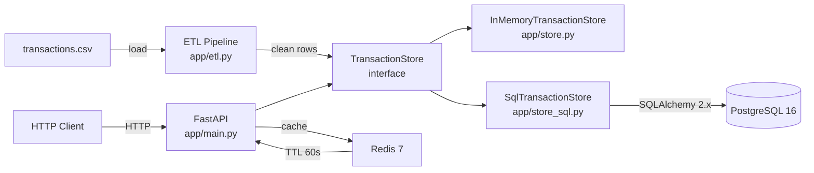

# AI-Powered Transaction Processing Pipeline

A production-grade backend service that ingests a messy `transactions.csv`,
cleans it, and serves it through a REST API with Postgres persistence and
Redis caching.

## Overview

This service was built end-to-end as a Backend / DevOps interview assignment.
It demonstrates:

- A **defensive ETL pipeline** that handles dirty data (mixed date formats,
  currency symbols, casing, nulls, duplicates).
- A **pluggable storage layer** — same interface for in-memory and Postgres
  implementations.
- A **FastAPI** REST API with filtering, pagination, and aggregate endpoints.
- **Redis caching** for expensive aggregates (60s TTL, graceful degradation).
- **Docker Compose** orchestration with health-gated startup.
- **CI** on every push (lint, test with real Postgres + Redis, Docker build).

## Architecture



The `TransactionStore` abstract base class lets us swap storage backends
without touching the route layer. The in-memory implementation is used in
tests and as a fallback if the DB is unavailable; the SQL implementation
is the production default.

## Quick Start

### Option 1: Docker (recommended)

```bash
git clone https://github.com/rifatbond007/AI-Powered-Transaction-Processing-Pipeline.git
cd AI-Powered-Transaction-Processing-Pipeline
cp .env.example .env
make docker-up      # or: docker compose up -d
```

Wait ~10 seconds for the stack to be healthy, then:

```bash
curl http://localhost:8000/health
# {"status":"ok"}
```

Interactive API docs: <http://localhost:8000/docs>

### Option 2: Local Python

```bash
python -m venv .venv && source .venv/bin/activate
make install
make run            # uvicorn app.main:app --reload  (in-memory store)
```

The in-memory store auto-loads `transactions.csv` from the project root.

## Endpoints

| Method | Path                      | Description                                       |
| ------ | ------------------------- | ------------------------------------------------- |
| GET    | `/health`                 | Liveness probe                                    |
| GET    | `/transactions`           | List transactions (filters + pagination)          |
| GET    | `/transactions/{txn_id}`  | Get a single transaction                          |
| GET    | `/summary`                | Aggregate summary (Redis-cached, 60s TTL)         |
| GET    | `/suspicious`             | Transactions flagged as suspicious                |

### Query parameters for `/transactions`

| Param        | Type    | Notes                                                     |
| ------------ | ------- | --------------------------------------------------------- |
| `start_date` | date    | Inclusive (YYYY-MM-DD)                                    |
| `end_date`   | date    | Inclusive (YYYY-MM-DD)                                    |
| `status`     | string  | `SUCCESS` \| `FAILED` \| `PENDING`                        |
| `category`   | string  | e.g. `Shopping`, `Food`, `Travel`                         |
| `account_id` | string  | e.g. `ACC001`                                             |
| `currency`   | string  | Original currency: `INR` \| `USD` \| `EUR` \| `GBP`       |
| `limit`      | int     | 1–500 (default 50)                                        |
| `offset`     | int     | >= 0 (default 0)                                          |

### Examples

```bash
# All transactions, newest first, first page
curl http://localhost:8000/transactions

# Filter by account and status
curl "http://localhost:8000/transactions?account_id=ACC001&status=SUCCESS"

# Date range
curl "http://localhost:8000/transactions?start_date=2024-06-01&end_date=2024-06-30"

# Pagination
curl "http://localhost:8000/transactions?limit=10&offset=20"

# Single transaction
curl http://localhost:8000/transactions/TXN1001

# Aggregate summary
curl http://localhost:8000/summary

# Suspicious transactions
curl http://localhost:8000/suspicious
```

## ETL Rules

The pipeline (`app/etl.py`) is defensive by design — bad rows go to a
`quarantine` list with a reason, never silently dropped. See
[`instruction.md`](./instruction.md) section 4 for the full ruleset.

| Rule                          | Behavior                                                |
| ----------------------------- | ------------------------------------------------------- |
| Date parsing                  | Auto-detects `dd-mm-yyyy`, `yyyy/mm/dd`, `yyyy-mm-dd`   |
| Amounts                       | Strips `$`, `€`, `£`, commas, whitespace                |
| Currency normalization        | Lower/uppercase → uppercase; invalid → quarantine       |
| INR conversion                | USD 83.2 / EUR 90.5 / GBP 107.8 (static per spec)       |
| Status normalization          | `success` / `Success` / `SUCCESS` → `SUCCESS`           |
| Missing `txn_id`              | Regenerated as `TXN_GEN_<row_index>`                    |
| Duplicates                    | Detected on `(txn_id, date, amount, account_id)`        |
| Suspicious flag               | `amount_inr > 100,000` OR note contains `SUSPICIOUS`    |

## Development

Common commands (or use `make <target>`):

```bash
make install      # install all deps
make lint         # ruff check
make format       # auto-format
make test         # run pytest
make test-cov     # run pytest with coverage
make run          # run API locally (in-memory store)
make docker-up    # start full stack
make docker-down  # stop stack + wipe DB
make docker-logs  # tail logs
make clean        # remove build artifacts
```

## Testing

```bash
make test         # 71 tests
make test-cov     # 71 tests with coverage report
```

Tests use:
- **Pandas** + custom fixtures (no network) for ETL unit tests.
- **In-memory store** for API unit tests.
- **SQLite in-memory** + **fakeredis** for SQL/cache tests (no external services needed locally).
- **Real Postgres + Redis** service containers in CI (`.github/workflows/ci.yml`).

Coverage is enforced at **70%** minimum in CI.

## Project Structure

```
.
├── app/                    # Application code
│   ├── main.py             # FastAPI app + lifespan
│   ├── config.py           # Pydantic settings (env-driven)
│   ├── database.py         # SQLAlchemy engine + session
│   ├── models.py           # ORM models
│   ├── schemas.py          # Pydantic request/response models
│   ├── etl.py              # ETL pipeline
│   ├── store.py            # In-memory store (interface + impl)
│   ├── store_sql.py        # Postgres store (same interface)
│   ├── cache.py            # Redis wrapper
│   ├── dependencies.py     # FastAPI DI helpers
│   └── routes/             # API route modules
│       ├── health.py
│       ├── transactions.py
│       └── summary.py
├── scripts/
│   ├── init_db.py          # One-shot DB loader (CSV -> ETL -> Postgres)
│   └── entrypoint.py       # Container entrypoint (wait for DB, init, exec)
├── tests/                  # pytest suite (71 tests)
├── .github/workflows/
│   └── ci.yml              # CI: lint + test + docker build
├── Dockerfile              # Multi-stage, non-root, healthcheck
├── docker-compose.yml      # api + postgres + redis
├── Makefile                # Common dev commands
├── pyproject.toml          # ruff + pytest config
├── requirements.txt        # Runtime deps
├── requirements-dev.txt    # Test deps
├── instruction.md          # The rulebook followed throughout
└── README.md
```

## Tradeoffs & Decisions

| Decision | Rationale |
| -------- | --------- |
| **SQLAlchemy 2.x (not 1.x)** | Modern typed API, future-proof, better mypy support. |
| **Pluggable `TransactionStore` interface** | Routes don't care about storage. Tests use in-memory, prod uses Postgres. Easy to add (e.g.) BigQuery later. |
| **Pydantic v2** | 5-50x faster than v1, better type inference, native discriminated unions. |
| **Static exchange rates** | Spec says "use these rates". A real prod system would call a rates API with caching. |
| **`Decimal` -> `float`** in API | JSON doesn't have a `Decimal` type; we round to 2dp at ETL time. Acceptable for amounts up to ~9 trillion INR. |
| **Composite indexes** `(account_id, date)` and `(status, date)` | These are the two most common filter combinations in practice. |
| **In-memory cache fallback to in-process** | A non-issue in containers (Redis is always there), but the API can also run standalone for demos without Redis. |
| **Multi-stage Dockerfile** | Final image has no compiler, no pip cache, no `.pyc` files. ~370MB. |
| **No Alembic migrations** | Out of scope for the assignment. `Base.metadata.create_all()` is fine for fresh DBs. Production would use Alembic with a baseline. |
| **Graceful DB fallback** | If Postgres is unreachable, the app still starts with the in-memory store. Useful in dev / disaster scenarios. |
| **f-string SQL? Never.** | All queries use SQLAlchemy parameter binding — injection-safe. |

## Out of Scope (per assignment)

- Authentication / authorization
- Rate limiting
- Horizontal scaling, k8s manifests
- Real currency exchange API
- Frontend / dashboard

## License

For interview evaluation only.
