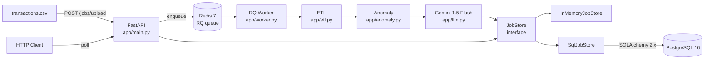

# AI-Powered Transaction Processing Pipeline

A production-grade async backend that ingests a messy `transactions.csv`,
cleans + classifies + summarizes it through a job queue + LLM, and exposes
the structured output via a small REST API.

This service was built end-to-end as a Backend / DevOps interview assignment.
It demonstrates:

- A **defensive ETL pipeline** that handles dirty data (mixed date formats,
  currency symbols, casing, nulls, duplicates).
- **Asynchronous, job-based processing** — `POST /jobs/upload` returns `202`
  immediately and the actual work happens in an RQ worker.
- **Anomaly detection** (3× per-account-median OR USD paid to a domestic-only
  brand).
- **Batched, retried LLM classification** of uncategorised rows via
  Gemini 1.5 Flash (free tier), plus an LLM-generated narrative summary.
- A **pluggable storage layer** — `JobStore` ABC with in-memory and Postgres
  implementations.
- **Docker Compose** orchestration: api + worker + Postgres + Redis.
- **CI** on every push (lint, test, Docker build).

## Architecture



The `JobStore` ABC lets us swap backends without touching routes or the
worker. In-memory is used in tests and `make dev`; Postgres is the production
default. **The store is the source of truth for job status** — RQ is only used
to signal "ready to process".

## Quick Start

### Option 1: Docker (recommended)

```bash
git clone https://github.com/rifatbond007/AI-Powered-Transaction-Processing-Pipeline.git
cd AI-Powered-Transaction-Processing-Pipeline
cp .env.example .env
# (Optional) edit .env to set GOOGLE_API_KEY for real LLM calls
make up             # or: docker compose up -d
```

Wait ~10 seconds for the stack to be healthy, then:

```bash
curl http://localhost:8000/health
# {"status":"ok"}
```

Interactive API docs: <http://localhost:8000/docs>

### Option 2: Local Python (in-memory store, no services)

For quick dev iteration without Docker:

```bash
python3 -m venv .venv && source .venv/bin/activate
make install
make dev            # uvicorn app.main:app --reload  (in-memory store)
```

Without `GOOGLE_API_KEY`, the LLM calls return `llm_failed=True` and the rest
of the pipeline completes — this is the right failure mode for evaluating the
non-LLM logic.

## Endpoints

| Method | Path                       | Description                                |
| ------ | -------------------------- | ------------------------------------------ |
| GET    | `/health`                  | Liveness probe                             |
| POST   | `/jobs/upload`             | Upload CSV; returns 202 with `job_id`      |
| GET    | `/jobs`                    | List jobs (newest first)                   |
| GET    | `/jobs/{job_id}/status`    | Job status + counts + error (if any)       |
| GET    | `/jobs/{job_id}/results`   | Transactions + summary (404/409/200)       |

### Examples

```bash
# Upload a CSV
JOB=$(curl -sS -F file=@transactions.csv http://localhost:8000/jobs/upload | jq -r .job_id)
echo "job: $JOB"

# Poll status until done
while true; do
  STATUS=$(curl -sS http://localhost:8000/jobs/$JOB/status | jq -r .status)
  echo "  status: $STATUS"
  [ "$STATUS" = "completed" -o "$STATUS" = "failed" ] && break
  sleep 2
done

# Fetch full results
curl -sS http://localhost:8000/jobs/$JOB/results | jq '{summary, llm_failures: (.transactions | map(select(.llm_failed)) | length)}'

# List all jobs
curl http://localhost:8000/jobs | jq '{total, items: [.items[].job_id]}'
```

### Status codes

- `POST /jobs/upload` → **202** on success; **415** bad content type; **413**
  > 10 MiB; **400** empty file.
- `GET /jobs/{id}/status` → **200** or **404**.
- `GET /jobs/{id}/results` → **200**; **404** unknown; **409** if job not yet
  `completed`; **500** if completed but summary missing.

## ETL Rules (PDF §5(a))

The pipeline (`app/etl.py`) is defensive by design — bad rows go to a
`quarantine` list with a reason, never silently dropped.

| Rule                          | Behavior                                                |
| ----------------------------- | ------------------------------------------------------- |
| Date parsing                  | Auto-detects `dd-mm-yyyy`, `yyyy/mm/dd`, `yyyy-mm-dd`   |
| Amounts                       | Strips `$`, `€`, `£`, commas, whitespace                |
| Currency normalization        | Lower/uppercase → uppercase; invalid → quarantine       |
| Status normalization          | `success` / `Success` / `SUCCESS` → `SUCCESS`           |
| Missing `category`            | Filled with `"Uncategorised"` (PDF requirement)         |
| Missing `txn_id`              | Regenerated as `TXN_GEN_<row_index>`                    |
| Missing `account_id`          | Quarantined                                             |
| Unparseable date / amount     | Quarantined                                             |
| Duplicates                    | Detected on `(txn_id, date, amount, account_id)`        |

## Anomaly Detection (PDF §5(b))

`app/anomaly.py` flags rows where **either** rule fires:

1. **Amount > 3× per-account median.** Computed per `account_id` from the
   cleaned rows. Single-row accounts skip this rule (median equals value).
2. **USD paid to a domestic-only brand.** Domestic brands: `Swiggy`,
   `Ola`, `IRCTC`. INR paid to these brands is fine.

Both can fire on the same row — the `anomaly_reason` field joins them with
`+` (e.g. `amount_3x_median+usd_domestic`).

## LLM (PDF §5(c)–(e))

- **Provider**: Gemini 1.5 Flash via `google-generativeai` (free tier, no
  spend). Configure with `GOOGLE_API_KEY`.
- **Batch size**: 20 rows per `classify_categories` call
  (`LLM_BATCH_SIZE=20`).
- **Retry**: 3 attempts with exponential backoff (1s, 2s, 4s) via `tenacity`.
- **Failure isolation**: a batch that fails is marked `llm_failed=True` on
  each row; the **job still completes** (PDF §5(e)). Only ETL/DB/IO errors
  mark the job `failed`.
- **Narrative**: a single `generate_summary` call after transactions are
  persisted; returns `total_spend_by_currency`, `top_3_merchants`,
  `narrative`, `risk_level`.

If `GOOGLE_API_KEY` is unset, both calls return `{"llm_failed": True}` after
exhausting retries — the worker handles this and the job still completes.

## Development

```bash
make help        # show all available targets
make install     # install all deps (requires active venv)
make lint        # ruff check
make format      # auto-format
make test        # run pytest (32 tests, no services needed)
make test-cov    # run pytest with coverage
make up          # start full stack via Docker (api + worker + postgres + redis)
make down        # stop stack and wipe DB volume
make logs        # tail logs from all services
make dev         # run API locally with in-memory store
make worker      # run rq worker locally
make clean       # remove build artifacts
```

## Testing

```bash
make test         # 32 tests
make test-cov     # 32 tests with coverage report
```

Tests use:
- **Pandas** + custom fixtures (`sample_csv_path`, `real_csv_path`) for ETL
  unit tests.
- **In-memory `JobStore`** for API + worker tests.
- **SQLite in-memory** for SQL store tests.
- **fakeredis** for RQ queue tests (no real Redis needed locally).
- **Real Postgres + Redis** service containers in CI
  (`.github/workflows/ci.yml`).

## Project Structure

```
.
├── app/                    # Application code
│   ├── main.py             # FastAPI app + lifespan
│   ├── config.py           # Pydantic settings (env-driven)
│   ├── database.py         # SQLAlchemy engine + session
│   ├── models.py           # ORM models (Job, Transaction, JobSummary)
│   ├── schemas.py          # Pydantic request/response models
│   ├── etl.py              # ETL pipeline (cleaning only)
│   ├── anomaly.py          # 3x-median + USD-domestic anomaly rules
│   ├── llm.py              # Gemini classifier + summary (retried)
│   ├── queue.py            # RQ get_queue + enqueue_process_job
│   ├── upload.py           # CSV upload lifecycle (save + cleanup)
│   ├── worker.py           # RQ task: process_job
│   ├── fx.py               # Static rates + to_inr helper
│   ├── storage.py          # JobStore ABC + InMemory + Sql impls
│   ├── dependencies.py     # FastAPI DI helpers
│   └── routes/
│       ├── health.py
│       └── jobs.py         # /jobs/upload, /jobs, /jobs/{id}/{status,results}
├── scripts/
│   ├── init_db.py          # Schema-only (drop_all + create_all)
│   └── entrypoint.py       # Container entrypoint (wait + exec)
├── tests/                  # pytest suite (32 tests)
├── .github/workflows/
│   └── ci.yml              # CI: lint + test + docker build
├── Dockerfile              # Multi-stage, non-root, healthcheck
├── docker-compose.yml      # api + worker + postgres + redis
├── Makefile                # Common dev commands
├── pyproject.toml          # ruff + pytest config
├── requirements.txt        # Runtime deps
├── requirements-dev.txt    # Test deps
├── Backend_DevOps_Assignment.pdf  # The authoritative spec
└── README.md
```

## Tradeoffs & Decisions

| Decision | Rationale |
| -------- | --------- |
| **RQ + Redis (not Celery)** | RQ is simpler, pure-Python, and matches the small surface area of this app. Celery is overkill for one queue type. |
| **Gemini 1.5 Flash (not OpenAI)** | Free tier, no spend. Matches the assignment's "no spend required" constraint. |
| **Job-based async (not synchronous)** | LLM calls + ETL can take seconds. Returning a `job_id` and letting the client poll is the right UX. |
| **Pluggable `JobStore` interface** | Routes and worker don't care about storage. Tests use in-memory; prod uses Postgres. |
| **Pydantic v2** | 5-50x faster than v1, better type inference, native discriminated unions. |
| **Static exchange rates** | The PDF specifies static rates. A real prod system would call a rates API with caching. |
| **`Decimal` -> `float`** in API | JSON doesn't have a `Decimal` type; we round to 2dp at ETL time. Acceptable for amounts up to ~9 trillion INR. |
| **No Alembic migrations** | Out of scope for the assignment. `Base.metadata.create_all()` is fine for fresh DBs. Production would use Alembic with a baseline. |
| **Multi-stage Dockerfile** | Final image has no compiler, no pip cache, no `.pyc` files. ~370MB. |
| **f-string SQL? Never.** | All queries use SQLAlchemy parameter binding — injection-safe. |

## Out of Scope (per assignment)

- Authentication / authorization
- Rate limiting
- Horizontal scaling manifests (scale workers with
  `docker compose up --scale worker=N`)
- Real currency exchange API
- Frontend / dashboard

## License

For interview evaluation only.
